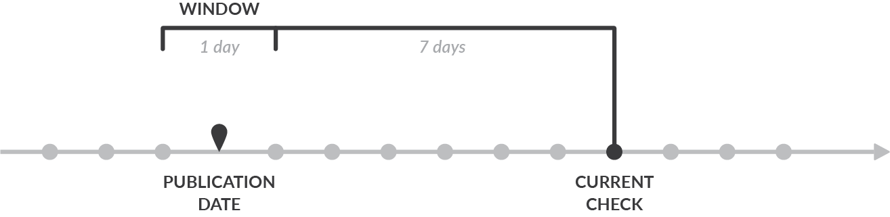
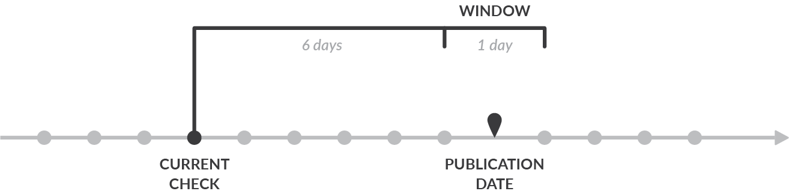
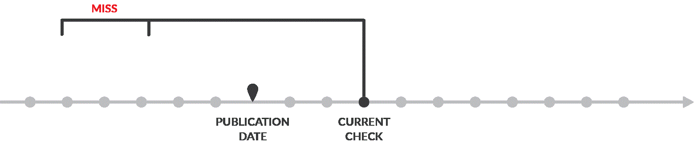

# Scheduled Triggers


[Download this extension](https://bracketspace.com/downloads/notification-scheduled-triggers/)


## How the plugin works

Let's assume that you want to send a notification **7 days after post publication date**. The time window is set to 1 day. This setting means that it will match any post which publication date was between 8 and 7 days ago.




The notification **7 days before post publication date** (scheduled post) works the similar way. The time window is as well 1 day. This setting means that it will match any post which has future publication date between 6 and 7 days in the future.



### Behind the scenes

The plugin is running on the WordPress Cron. The default schedule is 1 hour, but you can make it run every day or week, it's configurable.

On each of the executions, the proper objects (Posts or Users) are picked from the database. If you are using the Merge Tag time value, **all not locked object are queried**.



If there's a match and Notification gets sent, the object is locked for a specific time.&#x20;

### Window setting

Defines the time window in which the trigger can be executed. The time setting you set above is a point in time. Having the time window set to 5 minutes means what only 5 minutes after this point in time, the trigger can be executed. This prevents targeting irrelevant posts or users.

Example: having a point in time set to 1 hour after post publication date and 1 day time window, means that if post is published now, only within 1 day this trigger can be executed and match your post.

It's the best to keep the window at least two times longer than the trigger schedule. If the trigger runs daily, set the window to two days. If it will be too short, no object will ever match.

### Lock setting

Used to lock the matched item for a specific time. Ie. when a certain post gets matched and the notification is sent, it can be locked for the next 1 day. It won't be matched again during this time.

You must lock the object either for a specific time or forever to prevent the notification flood.

## Optimization

It's the best to use the predefined options whenever possible:

* Publication date (post)
* Modification date (post)
* Registration date (user)

This way the plugin will query only relevant objects from database.

If you use the Merge Tag, ie. with post meta, the plugin has to pull all not locked objects from database and test each one of them separately. It may cause a high resource usage if you have many posts/users in database and you run a very frequent schedule.

## Post Statuses

By default, only some of the post statuses are covered by the scheduled triggers. this is preventing the notifications to be sent for unpublished posts.

| Post Type                                             | Statuses                   |
| ----------------------------------------------------- | -------------------------- |
| WooCommerce Order                                     | `Processing`, `Completed`  |
| <p>All other CPTs</p><p>Including Posts and Pages</p> | `Published`, `Future`      |

To alter that behavior you can add a custom filter where you manipulate the list of supported statuses. Below example shows how to send scheduled notification for WooCommerce Orders only when the status is `shipped`

```php
add_filter( 'notification/scheduled_triggers/picker/post/post_statuses', function ( $statuses, $post_type ) {
    if ( 'shop_order' === $post_type ) {
        return [
            'shipped',
        ];
    }

    return $statuses;
}, 10, 2 );
```

## Troubleshooting

Follow the below steps when your scheduled messages aren't sent.

1. Make sure WordPress Cron is running correctly. Navigate to WordPress Dashboard -> Tools -> Site Health and search for a warning that cron might not be running correctly.\
   If that's the case, it might help to [hook the WP Cron into the system scheduler](https://developer.wordpress.org/plugins/cron/hooking-wp-cron-into-the-system-task-scheduler/).
2. If you're using the merge tag value, make sure the tag returns a proper date. Simply change the trigger to something easily testable (like Post Updated) and use that merge tag in the body to check its output.
3. If you're using the merge tag value, make sure the date/time returned is parseable (ie. not translated or in a weird format). To do that, use the [strtotime function tester](https://strtotime.co.uk/) and check the value rendered by the merge tag you're using (see step above)
4. Ensure you followed [basic deliverability troubleshooting section](https://docs.bracketspace.com/notification/user-guide/troubleshooting#nothing-is-sent)
5. Ensure the scheduled trigger window setting is not too short. The healthy value is twice as much as the schedule. So if the scheduled trigger runs every 1 hour, the window setting should be set to 2 hours.&#x20;
