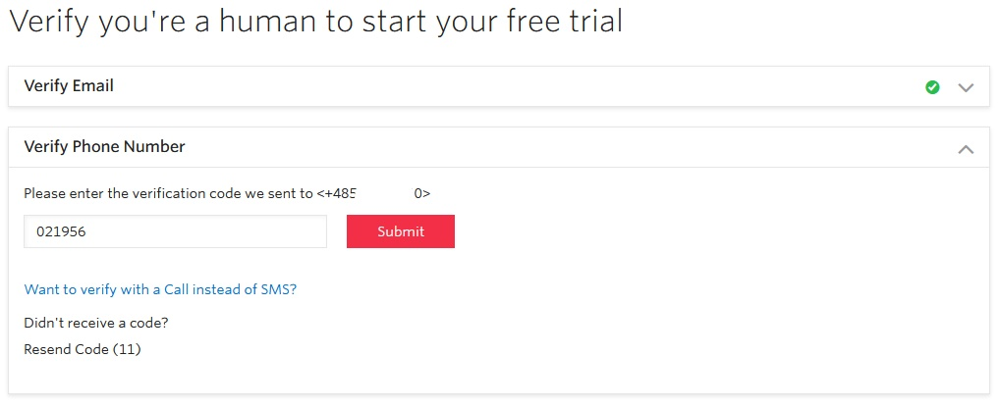
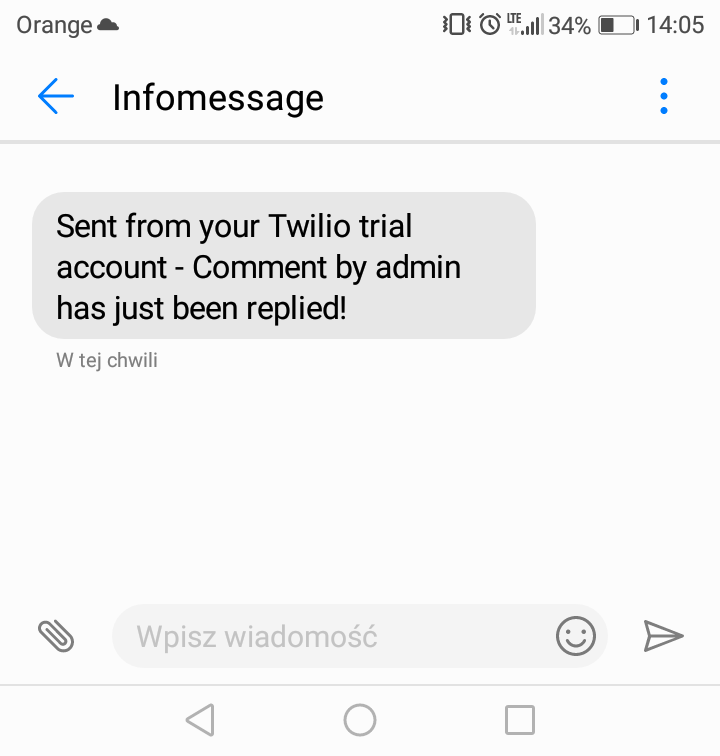

# Twilio


[Download this extension](https://bracketspace.com/downloads/notification-twilio/)


## Extention Installation

See how to install an extension:



## Twilio Account

Once you have your Twilio extension installed, you should care about getting your [Twilio account](https://www.twilio.com/console), unless you already have one and want to [skip](twilio.md#notifications-settings).

Just give your name and email address and your free trial Twilio account is started.

After your email confirmation, you should also give your phone number to complete registration.

Next, you will be asked to enter the verification code that you should get via SMS.  

After a few initial questions, you will be redirected to the Dashboard.

Here you can and should get your trial number.

And now you have everything you need to get started.

## Notification's Settings

The next thing to do is to go to `Notification -> Settings -> Carrier -> Twilio` and enable Twilio SMS Carrier with the **Account SID** and **Auth token** from your Twilio Dashboard.

Now let's create your first SMS notification, shall we?

## Create notification

Adding new notification is no different than in its standard version. To see basic information about the notifications see [this chapter](../user-guide/how-to-create-notifications.md#define-new-notification).

After giving your notification a name and choosing the trigger, select Twilio - SMS Carrier.

In the carrier box, you can add one or more recipients, you should provide the number you got in the Twilio Dashboard, and enter the text of the message. All the merge tags you can use are listed in the Merge Tag section on the right.

And now, when someone replies a comment, recipients get a message!

## Going live

After you have your email and phone number confirmed, the main thing you need to do to upgrade your Twilio account it to add Company Address, Billing Address, and Payment Information.

To see more details about going live visit the [Twilio support](https://support.twilio.com/hc/en-us/articles/223183208-Upgrading-to-a-paid-Twilio-Account).

