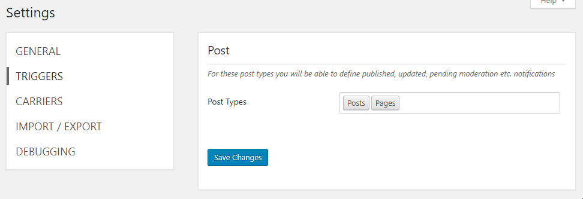

# Custom Post Type support

By default, the Notification plugin have the Post and Page enabled, but you are free to enable also other Post Types in the plugin Settings.

Just navigate to Notification plugin Settings and into the _Triggers_ section. Then, in _Post Types_ setting select your Post Type and save the settings.

After that, you will be able to use all the set of Post triggers, like _Post Type updated_ or _Post type added._

### Support for non-public Custom Post Type

To enable support for non-public Custom Post Type you are going to need a short code snippet. Please refer to the article below.



