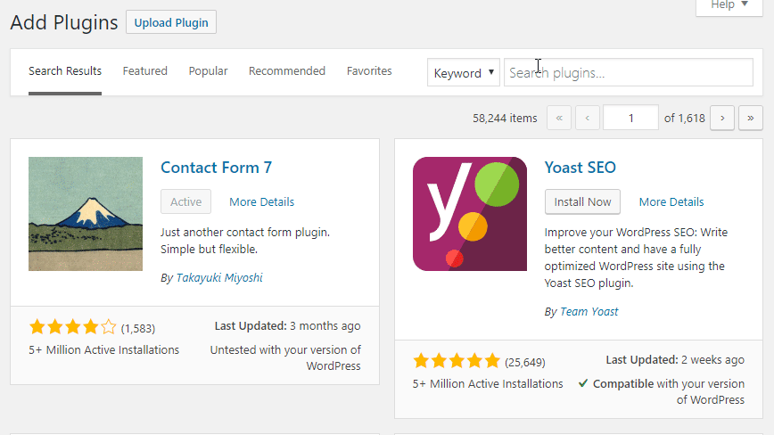

# How to create Notifications

## Install the plugin


If you already have the plugin installed, [skip this section](how-to-create-notifications.md#define-new-notification)


The Notification plugin can be downloaded from [official WordPress repository](https://wordpress.org/plugins/notification/). That means you can search for it in your WordPress dashboard.

Then you just have to activate it and you are all set!

## Define new Notification

In your WordPress dashboard you should see the `Notifications` menu. It will contain the `Add New Notification` link which will take you directly to your fresh Notification.

You can give your Notification a Title you want \(for internal use only\), select the Trigger you want to use and configure your Carriers.

To read more what the Trigger and Carrier is, see this article:



